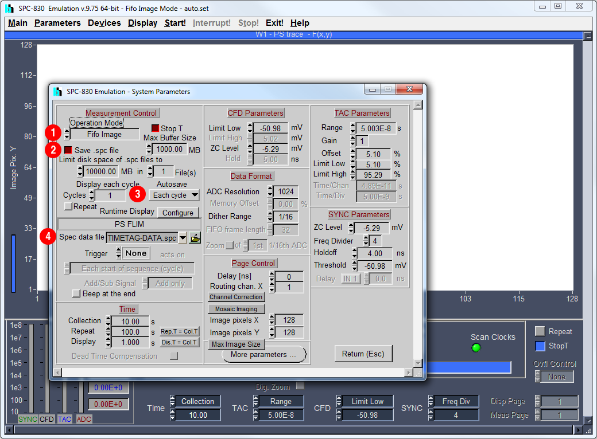

Acquiring data
==================================

Configuring your microscope
----------------------------------
Data must be acquired in a 'time tagged, time resolved' (TTTR) mode, also known as 'first in, first out' (FIFO).
At the moment, data acquired using FLIM systems from `Becker and Hickl <http://www.becker-hickl.com>`_ and `Picoquant <http://www.picoquant.com>`_ are supported. 

If you have TTTR data acquired using a different FLIM system please contact us and we may be able to add support for your data. 

The systems should be set up as discussed below. 

Picoquant
^^^^^^^^^^^^^^^^^^^^^^^^^
Galene supports data acquired using the PicoHarp 300, TimeHarp 260 and HydraHarp 400 in either the older .pt3 or newer .ptu format.
Data should be acquired in a TTTR 'T3' mode, the Picoquant acquisition software Symphotime will acquire data in this mode automatically.

Becker and Hickl 
^^^^^^^^^^^^^^^^^^^^^^^^^
Galene can read .spc photon stream files recorded by Spcm32/64 in FIFO mode. FIFO imaging mode is available supported the SPC-830, SPC-150, SPC-152, and SPC-154 modules.
Note that Spcm64 supports saving larger data files than Spcm32. To set up SPCImage to save .spc files:

- Open the ``System Parameters`` dialog from the Parameters menu
- ① Set ``Operation Mode`` to ``FIFO Image`` 
- ② Tick ``Save .spc file``   
- ③ Set ``Autosave`` to ``Each cycle``
- ④ Set the name of your file in ``Spec data file``

You can then setup your imaging parameters as normal and acquire data. Spcm32/64 can load the spc data later to convert it to sdt files for loading in SPCImage. 

Note that Galene cannot correct for motion in .sdt files, even those acquired in FIFO mode, as the data is histogrammed before saving.
This means that we cannot extract the individual frames from the FLIM acquisition. 

Optimal scanner parameters
------------------------------
Galene is able to correct for motion more effectively when the speed of the motion is slow relative to the time taken to acquire a single frame. 
Therefore, it is preferable to acquire many fast frames than a few frames more slowly. 
In general, the following tips can help acquire data in moving samples

- Use a fast scan rate, e.g. >1000Hz line rate
- Use a bidirectional scan where possible
- Reduce the number of pixels acquired in the image where possible
- Try and align fast (i.e. x) axis with direction of movement by rotating the scanner FOV

For more details please see `Warren et al. 2017 <http://doi.org/.....>`_.