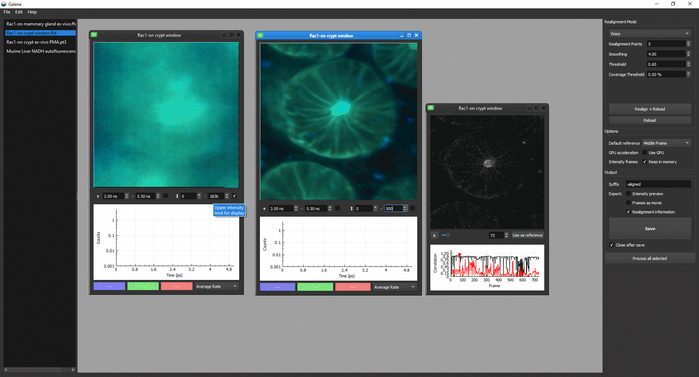

.. galene documentation master file, created by
   sphinx-quickstart on Wed Jun 14 20:43:20 2017.
   You can adapt this file completely to your liking, but it should at least
   contain the root `toctree` directive.

==================
Galene
==================
Galene is a tool to correct for sample motion in laser scanning fluorescence microscopy data, supporting both intensity-only and fluorescence lifetime imaging (FLIM) data. 

Using an approach based on the Lucas–Kanade framework, Galene estimates the sample displacement during each frame relative to a reference frame.  Using this information, the FLIM image may be reconstructed accounting for this motion, reassigning each photon arrival to the correct pixel producing a distortion-free image. For more information please see `Warren et al. 2017 <http://doi.org/.....>`_

This documentation will help you get started using Galene. If you use Galene in your paper, please :doc:`cite us <citing>`

.. toctree::

   getting-started
   acquiring-data
   tutorial
   correction-modes
   citing
