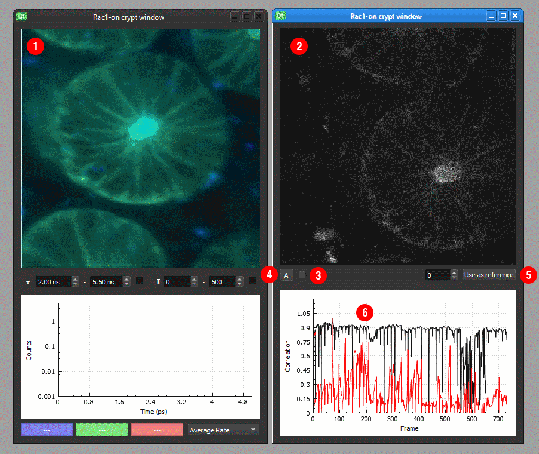
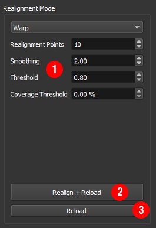

Tutorial
==================================

In this tutorial we describe how to load FLIM data, correct for motion and save the realigned data using Galene. 
Please also see the `video tutorial <http://www.vimeo.com/X>`_. 

Loading and opening data
^^^^^^^^^^^^^^^^^^^^^^^^
- Select a folder containing your data using `File>Open...`
- Double click on an image from the list to open ①
- An intensity mapped FLIM image will open the workspace ②
- Control the lifetime ③ and intensity ④ limits using the options below the image 

.. image:: 01.png
   :width: 100%

Correcting for motion
^^^^^^^^^^^^^^^^^^^^^^^^
- Select the ``Warp`` motion compensation ① approach using the drop down menu on the right
.. tip:: The ``Warp`` motion compensation mode takes the microscope scan pattern into account 
         and in most is the best option.
         For more about the correction modes and 
         the options available ② see :doc:`correction-modes`

- Align the data using the ``Realign + Reload`` button ③

Viewing the realignment results
^^^^^^^^^^^^^^^^^^^^^^^^
- The realigned FLIM image ① is shown alongside the individual intensity frames ②.
- Scroll ③ through the aligned or unaligned frames using the ``A`` button ④ in the realignment window.
- By default the first frame will be used as the reference. To select a different frame, press ``Use as reference`` 
  button ⑤ and realign the data using the `Realign + Reload` button.
- The graph below shows the correlation between the realigned frame and the reference frame 

Optimising the realignment results
^^^^^^^^^^^^^^^^^^^^^^^^
- Frames which are not well aligned can degrade the final image. 
- Reject frames which cannot be aligned by setting the correlation threshold.
- Reject frames where the movement was large by setting the coverage threshold. 
- Apply the thresholds without reprocessing the data by pressing ``Reload``

Saving the realigned image and results
^^^^^^^^^^^^^^^^^^^^^^^^
- When you are happy with the realignment, press ``Save`` ① to save the data as a histogrammed .ffh file.
  These can be read directly by FLIMfit or into Matlab using the FlimReaderMex file
- You can also output diagnostics about the fitting ②: 

   - ``Intensity preview``: save a png of the intensity of the realigned image. 
     This is conveneient for quickly assessing which files have been successfully realigned. 
   - ``Frames as movie``: save a tif stack of the aligned and unaligned frames for diagnostics
   - ``Realignment information``: save a csv file with the estimated displacements across the frames
- To process several files using the same settings, select multiple files and click ``Process all selected`` ⑤.

.. toctree::
   :maxdepth: 2

