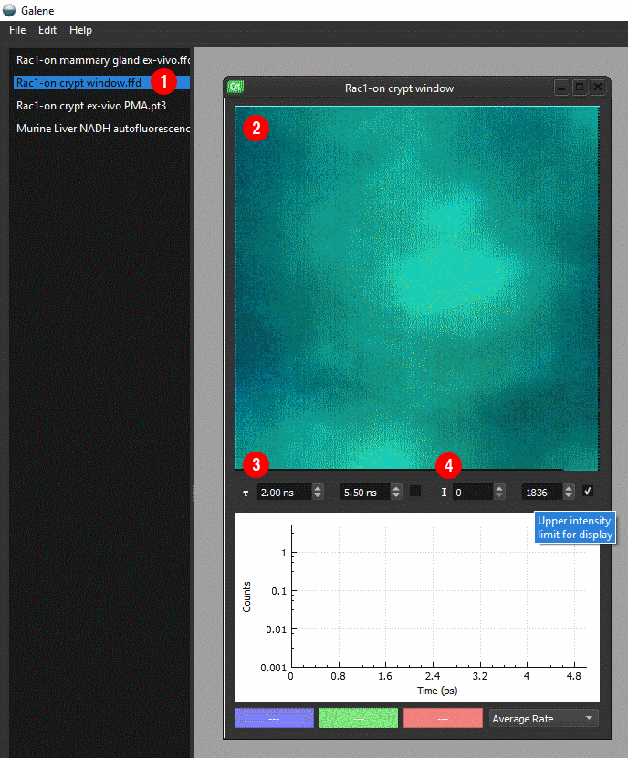

Tutorial
==================================

- Select a folder containing your data using `File>Open...`
- Double click on an image to open (1)
- We can see an intensity mapped image showing the mean arrival time (2)
.. note:: Control the lifetime (3) and intensity (4) limits using the options below the image 

- Select Warp motion compensation approach using the drop down menu on the right
.. tip:: In most cases, `Warp` is the best option. For more about the correction modes see :doc:`correction-modes`
- Align the data using the `Realign + Reload` button
- Scroll through the aligned and unaligned frames using the Realignment window.
   - Flick between the aligned and unaligned using the 'A' button
- By default the first frame will be used as the reference. To select a different frame, press `Use as reference` 
  button and realign the data
- The graph below shows the correlation between the realigned frame and the reference frame 
- Frames which are not well aligned can degrade the final image. 
   - Reject frames which cannot be aligned by setting the correlation threshold.
   - Reject frames where the movement was large by setting the coverage threshold. 
   - Apply the thresholds by pressing `Reload`
- When you are happy with the realignment, press `Save` to save the data as a histogrammed .ffh file.
  These can be read directly by FLIMfit or into Matlab using the FlimReaderMex file
- To process several files using the same settings, select multiple files and click `Process`
- You can also output diagnostics about the fitting by selecting several options. 
   - Save preview: save a png of the intensity of the realigned image. 
     This is conveneient for quickly assessing which files have been successfully realigned. 
   - Save movies: save a tif stack of the aligned and unaligned frames for diagnostics
   - Save alignment information: save a csv file with the estimated displacements across the frames

.. toctree::
   :maxdepth: 2

